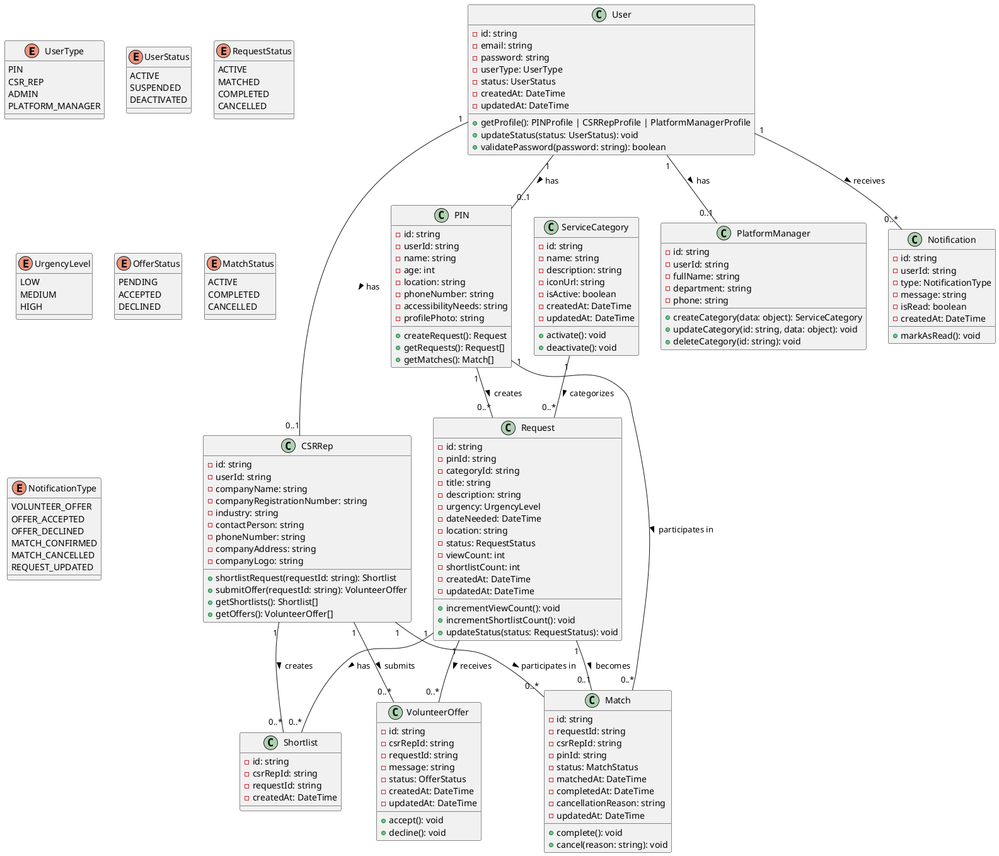
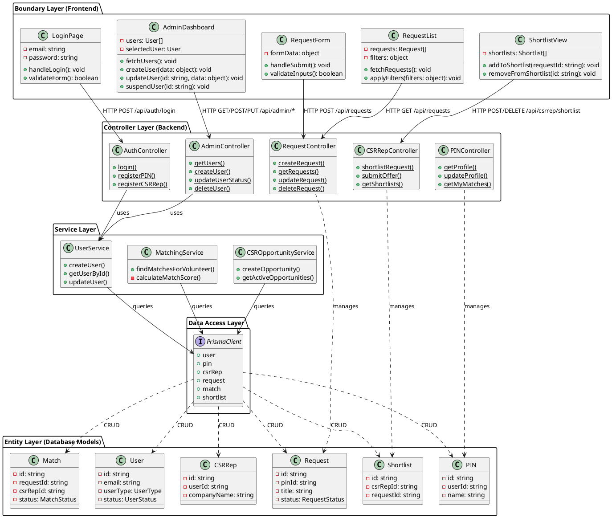

```plantuml
@startuml Service_Repository_Layer

' Repository Interfaces
interface UserRepository {
  + findById(id: string): Promise<User | null>
  + findByEmail(email: string): Promise<User | null>
  + create(user: Partial<User>): Promise<User>
  + update(id: string, updates: Partial<User>): Promise<User | null>
  + delete(id: string): Promise<boolean>
  + findAll(limit?: number, offset?: number): Promise<User[]>
}

interface VolunteerRepository {
  + findById(id: string): Promise<Volunteer | null>
  + findByEmail(email: string): Promise<Volunteer | null>
  + create(volunteer: Partial<Volunteer>): Promise<Volunteer>
  + update(id: string, updates: Partial<Volunteer>): Promise<Volunteer | null>
  + delete(id: string): Promise<boolean>
  + findBySkills(skills: string[]): Promise<Volunteer[]>
  + findByLocation(location: string): Promise<Volunteer[]>
}

interface OrganizationRepository {
  + findById(id: string): Promise<Organization | null>
  + create(org: Partial<Organization>): Promise<Organization>
  + update(id: string, updates: Partial<Organization>): Promise<Organization | null>
  + findVerified(): Promise<Organization[]>
}

interface CSROpportunityRepository {
  + findById(id: string): Promise<CSROpportunity | null>
  + create(opportunity: Partial<CSROpportunity>): Promise<CSROpportunity>
  + update(id: string, updates: Partial<CSROpportunity>): Promise<CSROpportunity | null>
  + findByOrganization(orgId: string): Promise<CSROpportunity[]>
  + findBySkills(skills: string[]): Promise<CSROpportunity[]>
  + findActive(): Promise<CSROpportunity[]>
}

interface MatchingRepository {
  + findById(id: string): Promise<Matching | null>
  + create(matching: Partial<Matching>): Promise<Matching>
  + findByVolunteer(volunteerId: string): Promise<Matching[]>
  + findByOpportunity(opportunityId: string): Promise<Matching[]>
  + findTopMatches(volunteerId: string, limit?: number): Promise<Matching[]>
}

' Service Classes
class UserService {
  - userRepository: UserRepository
  + constructor(userRepository: UserRepository)
  + createUser(userData: CreateUserDTO): Promise<ApiResponse<User>>
  + getUserById(id: string): Promise<ApiResponse<User>>
  + updateUser(id: string, updates: UpdateUserDTO): Promise<ApiResponse<User>>
  + deleteUser(id: string): Promise<ApiResponse<boolean>>
  + getAllUsers(limit?: number, offset?: number): Promise<ApiResponse<User[]>>
  - validateUserData(data: object): boolean
}

class VolunteerService {
  - volunteerRepository: VolunteerRepository
  + constructor(volunteerRepository: VolunteerRepository)
  + createVolunteer(data: CreateVolunteerDTO): Promise<ApiResponse<Volunteer>>
  + getVolunteerById(id: string): Promise<ApiResponse<Volunteer>>
  + updateVolunteer(id: string, updates: UpdateVolunteerDTO): Promise<ApiResponse<Volunteer>>
  + findVolunteersBySkills(skills: string[]): Promise<ApiResponse<Volunteer[]>>
}

class OrganizationService {
  - organizationRepository: OrganizationRepository
  + constructor(organizationRepository: OrganizationRepository)
  + createOrganization(data: CreateOrganizationDTO): Promise<ApiResponse<Organization>>
  + getOrganizationById(id: string): Promise<ApiResponse<Organization>>
  + updateOrganization(id: string, updates: UpdateOrganizationDTO): Promise<ApiResponse<Organization>>
  + getVerifiedOrganizations(): Promise<ApiResponse<Organization[]>>
  - verifyOrganization(id: string): Promise<void>
}

class CSROpportunityService {
  - opportunityRepository: CSROpportunityRepository
  - organizationRepository: OrganizationRepository
  + constructor(opportunityRepo: CSROpportunityRepository, orgRepo: OrganizationRepository)
  + createOpportunity(data: CreateCSROpportunityDTO): Promise<ApiResponse<CSROpportunity>>
  + getOpportunityById(id: string): Promise<ApiResponse<CSROpportunity>>
  + updateOpportunity(id: string, updates: UpdateCSROpportunityDTO): Promise<ApiResponse<CSROpportunity>>
  + getActiveOpportunities(): Promise<ApiResponse<CSROpportunity[]>>
  - validateOpportunityDates(startDate: Date, endDate: Date): boolean
}

class MatchingService {
  - matchingRepository: MatchingRepository
  - volunteerRepository: VolunteerRepository
  - opportunityRepository: CSROpportunityRepository
  + constructor(matchingRepo: MatchingRepository, volunteerRepo: VolunteerRepository, opportunityRepo: CSROpportunityRepository)
  + findMatchesForVolunteer(volunteerId: string): Promise<ApiResponse<Matching[]>>
  - calculateMatchScore(volunteer: Volunteer, opportunity: CSROpportunity): number
  - calculateLocationMatch(volunteerLoc: Location, oppLoc: Location): number
  - calculateAvailabilityMatch(availability: Availability[], opportunity: CSROpportunity): number
  - generateMatchReasons(volunteer: Volunteer, opportunity: CSROpportunity): string[]
}

' DTO Classes
class CreateUserDTO {
  + email: string
  + password: string
  + role: UserRole
  + name: string
  + phone?: string
}

class UpdateUserDTO {
  + name?: string
  + phone?: string
  + email?: string
}

class ApiResponse<T> {
  + success: boolean
  + data?: T
  + error?: string
  + message?: string
}

' Relationships
UserService --> UserRepository : uses
VolunteerService --> VolunteerRepository : uses
OrganizationService --> OrganizationRepository : uses
CSROpportunityService --> CSROpportunityRepository : uses
CSROpportunityService --> OrganizationRepository : uses
MatchingService --> MatchingRepository : uses
MatchingService --> VolunteerRepository : uses
MatchingService --> CSROpportunityRepository : uses

UserService ..> CreateUserDTO : uses
UserService ..> UpdateUserDTO : uses
UserService ..> ApiResponse : returns

@enduml
```

# Class Diagrams - CSR Volunteer Matching System

This document contains UML class diagrams for the CSR Volunteer Matching System following the Boundary-Controller-Entity (BCE) architectural pattern.

## Table of Contents
1. [Entity Layer Class Diagram](#1-entity-layer-class-diagram)
2. [Controller Layer Class Diagram](#2-controller-layer-class-diagram)
3. [Service & Repository Layer Class Diagram](#3-service--repository-layer-class-diagram)
4. [Complete BCE Architecture Diagram](#4-complete-bce-architecture-diagram)
5. [Frontend Component Class Diagram](#5-frontend-component-class-diagram)

---

## 1. Entity Layer Class Diagram

The Entity layer represents the core business objects and database models.



---

## 2. Controller Layer Class Diagram

The Controller layer handles HTTP requests and orchestrates business logic.

```plantuml
@startuml Controller_Layer

interface Request
interface Response
interface NextFunction

abstract class BaseController {
  # handleError(error: Error, next: NextFunction): void
}

class AuthController extends BaseController {
  + {static} registerPIN(req: Request, res: Response, next: NextFunction): Promise<void>
  + {static} registerCSRRep(req: Request, res: Response, next: NextFunction): Promise<void>
  + {static} login(req: Request, res: Response, next: NextFunction): Promise<void>
  + {static} getProfile(req: Request, res: Response, next: NextFunction): Promise<void>
  + {static} updatePassword(req: Request, res: Response, next: NextFunction): Promise<void>
  - {static} generateToken(payload: object): string
  - {static} validateCredentials(email: string, password: string): Promise<User>
}

class AdminController extends BaseController {
  + {static} getUsers(req: Request, res: Response, next: NextFunction): Promise<void>
  + {static} getUserById(req: Request, res: Response, next: NextFunction): Promise<void>
  + {static} createUser(req: Request, res: Response, next: NextFunction): Promise<void>
  + {static} updateUserStatus(req: Request, res: Response, next: NextFunction): Promise<void>
  + {static} deleteUser(req: Request, res: Response, next: NextFunction): Promise<void>
  + {static} getSystemStats(req: Request, res: Response, next: NextFunction): Promise<void>
  - {static} validateUserType(userType: string): boolean
  - {static} checkDuplicateEmail(email: string): Promise<boolean>
}

class PINController extends BaseController {
  + {static} getProfile(req: AuthRequest, res: Response, next: NextFunction): Promise<void>
  + {static} updateProfile(req: AuthRequest, res: Response, next: NextFunction): Promise<void>
  + {static} getMyMatches(req: AuthRequest, res: Response, next: NextFunction): Promise<void>
  + {static} getNotifications(req: AuthRequest, res: Response, next: NextFunction): Promise<void>
  + {static} markNotificationRead(req: AuthRequest, res: Response, next: NextFunction): Promise<void>
  + {static} markAllNotificationsRead(req: AuthRequest, res: Response, next: NextFunction): Promise<void>
}

class CSRRepController extends BaseController {
  + {static} shortlistRequest(req: AuthRequest, res: Response, next: NextFunction): Promise<void>
  + {static} removeShortlist(req: AuthRequest, res: Response, next: NextFunction): Promise<void>
  + {static} getShortlists(req: AuthRequest, res: Response, next: NextFunction): Promise<void>
  + {static} submitOffer(req: AuthRequest, res: Response, next: NextFunction): Promise<void>
  + {static} getMyOffers(req: AuthRequest, res: Response, next: NextFunction): Promise<void>
  + {static} getMyMatches(req: AuthRequest, res: Response, next: NextFunction): Promise<void>
  + {static} updateProfile(req: AuthRequest, res: Response, next: NextFunction): Promise<void>
  - {static} validateOfferEligibility(csrRepId: string, requestId: string): Promise<boolean>
}

class RequestController extends BaseController {
  + {static} createRequest(req: AuthRequest, res: Response, next: NextFunction): Promise<void>
  + {static} getRequests(req: AuthRequest, res: Response, next: NextFunction): Promise<void>
  + {static} getRequest(req: AuthRequest, res: Response, next: NextFunction): Promise<void>
  + {static} getMyRequests(req: AuthRequest, res: Response, next: NextFunction): Promise<void>
  + {static} updateRequest(req: AuthRequest, res: Response, next: NextFunction): Promise<void>
  + {static} deleteRequest(req: AuthRequest, res: Response, next: NextFunction): Promise<void>
  + {static} getCategories(req: Request, res: Response, next: NextFunction): Promise<void>
  - {static} validateRequestOwnership(userId: string, requestId: string): Promise<boolean>
  - {static} applyFilters(query: object): object
}

class MatchController extends BaseController {
  + {static} createMatch(req: AuthRequest, res: Response, next: NextFunction): Promise<void>
  + {static} getMatches(req: AuthRequest, res: Response, next: NextFunction): Promise<void>
  + {static} completeMatch(req: AuthRequest, res: Response, next: NextFunction): Promise<void>
  + {static} cancelMatch(req: AuthRequest, res: Response, next: NextFunction): Promise<void>
  - {static} notifyParticipants(matchId: string, type: string): Promise<void>
}

@enduml
```



---

## 3. Service & Repository Layer Class Diagram

The Service layer contains business logic, and Repository layer handles data access.



---

## 4. Complete BCE Architecture Diagram

This diagram shows the complete Boundary-Controller-Entity architecture.



---

## 5. Frontend Component Class Diagram

The frontend React components with TypeScript interfaces.

```plantuml
@startuml Frontend_Components

interface User {
  + id: string
  + email: string
  + userType: UserType
  + status: UserStatus
}

interface Request {
  + id: string
  + title: string
  + description: string
  + status: RequestStatus
  + urgency: UrgencyLevel
}

interface ServiceCategory {
  + id: string
  + name: string
  + description: string
  + isActive: boolean
}

class AuthService {
  - baseURL: string
  + login(credentials: LoginCredentials): Promise<AuthResponse>
  + logout(): void
  + getToken(): string | null
  + setToken(token: string): void
  + isAuthenticated(): boolean
}

class AdminService {
  - baseURL: string
  + getUsers(params: object): Promise<User[]>
  + createUser(userData: object): Promise<User>
  + updateUser(id: string, data: object): Promise<User>
  + deleteUser(id: string): Promise<void>
  + suspendUser(id: string): Promise<void>
  + getSystemStats(): Promise<object>
}

class RequestService {
  - baseURL: string
  + getRequests(filters: object): Promise<Request[]>
  + createRequest(data: object): Promise<Request>
  + updateRequest(id: string, data: object): Promise<Request>
  + deleteRequest(id: string): Promise<void>
  + getCategories(): Promise<ServiceCategory[]>
}

class CSRRepService {
  - baseURL: string
  + shortlistRequest(requestId: string): Promise<Shortlist>
  + getShortlists(): Promise<Shortlist[]>
  + submitOffer(requestId: string, message: string): Promise<VolunteerOffer>
  + getMyOffers(): Promise<VolunteerOffer[]>
  + getMyMatches(): Promise<Match[]>
}

class PINService {
  - baseURL: string
  + getProfile(): Promise<PINProfile>
  + updateProfile(data: object): Promise<PINProfile>
  + getMyRequests(): Promise<Request[]>
  + getMyMatches(): Promise<Match[]>
}

class LoginPage {
  - email: string
  - password: string
  - error: string
  - authService: AuthService
  + handleSubmit(e: Event): void
  + validateForm(): boolean
  + navigateToDashboard(): void
}

class AdminDashboard {
  - users: User[]
  - selectedUser: User | null
  - showCreateModal: boolean
  - adminService: AdminService
  + useEffect(): void
  + fetchUsers(): Promise<void>
  + handleCreateUser(data: object): Promise<void>
  + handleUpdateUser(id: string, data: object): Promise<void>
  + handleSuspendUser(id: string): Promise<void>
  + handleSearch(term: string): void
}

class CreateUserModal {
  - formData: object
  - userTypes: string[]
  - onClose: Function
  - onSubmit: Function
  + handleInputChange(e: Event): void
  + handleSubmit(e: Event): void
  + resetForm(): void
}

class UserDetailsModal {
  - user: User
  - onClose: Function
  - onUpdate: Function
  + handleUpdate(data: object): void
}

' Relationships
LoginPage --> AuthService : uses
AdminDashboard --> AdminService : uses
AdminDashboard *-- CreateUserModal : contains
AdminDashboard *-- UserDetailsModal : contains

CreateUserModal ..> User : creates
UserDetailsModal ..> User : updates

AuthService ..> User : authenticates
AdminService ..> User : manages
RequestService ..> Request : manages
CSRRepService ..> Request : interacts with
PINService ..> Request : creates

@enduml
```



---

## How to Use These Diagrams

### Online Rendering
1. **PlantUML Online Editor**: Copy any diagram code and paste it into [PlantText](https://www.planttext.com/) or [PlantUML Web Server](http://www.plantuml.com/plantuml/uml/)
2. **VS Code Extension**: Install "PlantUML" extension in VS Code to preview diagrams directly

### Generate Images
```bash
# Install PlantUML
brew install plantuml  # macOS
# or
sudo apt-get install plantuml  # Linux

# Generate PNG images
plantuml CLASS_DIAGRAMS.md
```

### Mermaid Alternative
If you prefer Mermaid diagrams (better GitHub support), I can also provide the diagrams in Mermaid format.

---

## Diagram Descriptions

### 1. Entity Layer
- Shows all database models and their relationships
- Includes enums for type safety
- Demonstrates one-to-one, one-to-many relationships

### 2. Controller Layer  
- Shows all HTTP request handlers
- Demonstrates separation of concerns
- Includes authentication and authorization logic

### 3. Service & Repository Layer
- Repository interfaces for data access abstraction
- Service classes containing business logic
- Shows dependency injection pattern

### 4. BCE Complete Architecture
- End-to-end view of the system
- Shows data flow from UI to Database
- Demonstrates layered architecture

### 5. Frontend Components
- React components with TypeScript
- Service layer for API communication
- Modal components for user interactions

---

## Architecture Patterns Used

1. **BCE (Boundary-Controller-Entity)**: Clear separation of concerns
2. **Repository Pattern**: Abstracted data access layer
3. **Service Layer Pattern**: Business logic encapsulation
4. **DTO Pattern**: Data transfer objects for API communication
5. **Dependency Injection**: Loose coupling between layers

---

## Notes
- All diagrams follow UML 2.0 standards
- Private methods/fields marked with `-`
- Public methods/fields marked with `+`
- Static methods marked with `{static}`
- Abstract classes shown with italics in PlantUML

