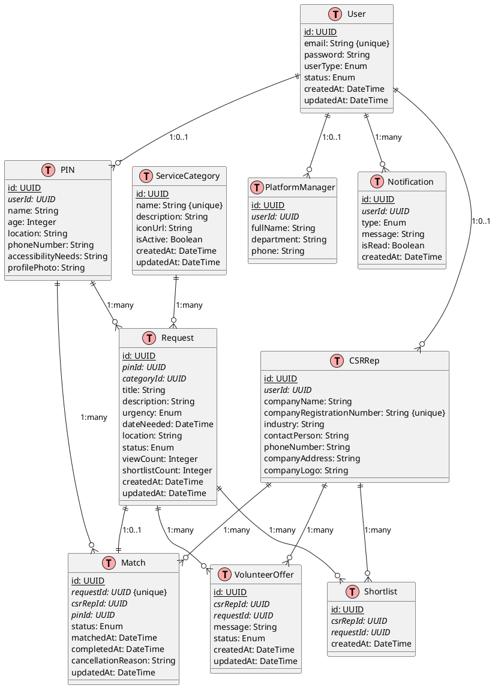
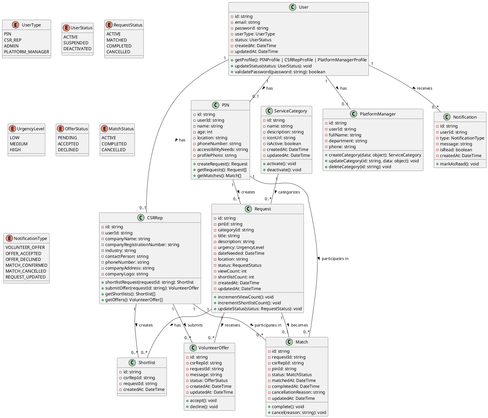

# Class Diagrams - CSR Volunteer Matching System

This document contains UML class diagrams and Entity Relationship Diagrams (ERD) for the CSR Volunteer Matching System.

## Table of Contents
1. [Entity Relationship Diagram (ERD)](#1-entity-relationship-diagram-erd)
2. [Entity Layer Class Diagram](#2-entity-layer-class-diagram)
3. [Controller Layer Class Diagram](#3-controller-layer-class-diagram)
4. [Service Layer Class Diagram](#4-service-layer-class-diagram)

---

## 1. Entity Relationship Diagram (ERD)

This ERD shows the database schema and relationships between entities.



---

## 2. Entity Layer Class Diagram

The Entity layer represents the core business objects and database models.



---

## 3. Controller Layer Class Diagram

The Controller layer handles HTTP requests and orchestrates business logic.

```plantuml
@startuml Controller_Layer

interface Request
interface Response
interface NextFunction

abstract class BaseController {
  # handleError(error: Error, next: NextFunction): void
}

class AuthController extends BaseController {
  + {static} registerPIN(req: Request, res: Response, next: NextFunction): Promise<void>
  + {static} registerCSRRep(req: Request, res: Response, next: NextFunction): Promise<void>
  + {static} login(req: Request, res: Response, next: NextFunction): Promise<void>
  + {static} getProfile(req: Request, res: Response, next: NextFunction): Promise<void>
  + {static} updatePassword(req: Request, res: Response, next: NextFunction): Promise<void>
  - {static} generateToken(payload: object): string
  - {static} validateCredentials(email: string, password: string): Promise<User>
}

class AdminController extends BaseController {
  + {static} getUsers(req: Request, res: Response, next: NextFunction): Promise<void>
  + {static} getUserById(req: Request, res: Response, next: NextFunction): Promise<void>
  + {static} createUser(req: Request, res: Response, next: NextFunction): Promise<void>
  + {static} updateUserStatus(req: Request, res: Response, next: NextFunction): Promise<void>
  + {static} deleteUser(req: Request, res: Response, next: NextFunction): Promise<void>
  + {static} getSystemStats(req: Request, res: Response, next: NextFunction): Promise<void>
  - {static} validateUserType(userType: string): boolean
  - {static} checkDuplicateEmail(email: string): Promise<boolean>
}

class PINController extends BaseController {
  + {static} getProfile(req: AuthRequest, res: Response, next: NextFunction): Promise<void>
  + {static} updateProfile(req: AuthRequest, res: Response, next: NextFunction): Promise<void>
  + {static} getMyMatches(req: AuthRequest, res: Response, next: NextFunction): Promise<void>
  + {static} getNotifications(req: AuthRequest, res: Response, next: NextFunction): Promise<void>
  + {static} markNotificationRead(req: AuthRequest, res: Response, next: NextFunction): Promise<void>
  + {static} markAllNotificationsRead(req: AuthRequest, res: Response, next: NextFunction): Promise<void>
}

class CSRRepController extends BaseController {
  + {static} shortlistRequest(req: AuthRequest, res: Response, next: NextFunction): Promise<void>
  + {static} removeShortlist(req: AuthRequest, res: Response, next: NextFunction): Promise<void>
  + {static} getShortlists(req: AuthRequest, res: Response, next: NextFunction): Promise<void>
  + {static} submitOffer(req: AuthRequest, res: Response, next: NextFunction): Promise<void>
  + {static} getMyOffers(req: AuthRequest, res: Response, next: NextFunction): Promise<void>
  + {static} getMyMatches(req: AuthRequest, res: Response, next: NextFunction): Promise<void>
  + {static} updateProfile(req: AuthRequest, res: Response, next: NextFunction): Promise<void>
  - {static} validateOfferEligibility(csrRepId: string, requestId: string): Promise<boolean>
}

class RequestController extends BaseController {
  + {static} createRequest(req: AuthRequest, res: Response, next: NextFunction): Promise<void>
  + {static} getRequests(req: AuthRequest, res: Response, next: NextFunction): Promise<void>
  + {static} getRequest(req: AuthRequest, res: Response, next: NextFunction): Promise<void>
  + {static} getMyRequests(req: AuthRequest, res: Response, next: NextFunction): Promise<void>
  + {static} updateRequest(req: AuthRequest, res: Response, next: NextFunction): Promise<void>
  + {static} deleteRequest(req: AuthRequest, res: Response, next: NextFunction): Promise<void>
  + {static} getCategories(req: Request, res: Response, next: NextFunction): Promise<void>
  - {static} validateRequestOwnership(userId: string, requestId: string): Promise<boolean>
  - {static} applyFilters(query: object): object
}

class MatchController extends BaseController {
  + {static} createMatch(req: AuthRequest, res: Response, next: NextFunction): Promise<void>
  + {static} getMatches(req: AuthRequest, res: Response, next: NextFunction): Promise<void>
  + {static} completeMatch(req: AuthRequest, res: Response, next: NextFunction): Promise<void>
  + {static} cancelMatch(req: AuthRequest, res: Response, next: NextFunction): Promise<void>
  - {static} notifyParticipants(matchId: string, type: string): Promise<void>
}

@enduml
```



---

## 4. Service Layer Class Diagram

The Service layer contains business logic and repository interfaces for data access.

```plantuml
@startuml Service_Repository_Layer

' Repository Interfaces
interface UserRepository {
  + findById(id: string): Promise<User | null>
  + findByEmail(email: string): Promise<User | null>
  + create(user: Partial<User>): Promise<User>
  + update(id: string, updates: Partial<User>): Promise<User | null>
  + delete(id: string): Promise<boolean>
  + findAll(limit?: number, offset?: number): Promise<User[]>
}

interface VolunteerRepository {
  + findById(id: string): Promise<Volunteer | null>
  + findByEmail(email: string): Promise<Volunteer | null>
  + create(volunteer: Partial<Volunteer>): Promise<Volunteer>
  + update(id: string, updates: Partial<Volunteer>): Promise<Volunteer | null>
  + delete(id: string): Promise<boolean>
  + findBySkills(skills: string[]): Promise<Volunteer[]>
  + findByLocation(location: string): Promise<Volunteer[]>
}

interface OrganizationRepository {
  + findById(id: string): Promise<Organization | null>
  + create(org: Partial<Organization>): Promise<Organization>
  + update(id: string, updates: Partial<Organization>): Promise<Organization | null>
  + findVerified(): Promise<Organization[]>
}

interface CSROpportunityRepository {
  + findById(id: string): Promise<CSROpportunity | null>
  + create(opportunity: Partial<CSROpportunity>): Promise<CSROpportunity>
  + update(id: string, updates: Partial<CSROpportunity>): Promise<CSROpportunity | null>
  + findByOrganization(orgId: string): Promise<CSROpportunity[]>
  + findBySkills(skills: string[]): Promise<CSROpportunity[]>
  + findActive(): Promise<CSROpportunity[]>
}

interface MatchingRepository {
  + findById(id: string): Promise<Matching | null>
  + create(matching: Partial<Matching>): Promise<Matching>
  + findByVolunteer(volunteerId: string): Promise<Matching[]>
  + findByOpportunity(opportunityId: string): Promise<Matching[]>
  + findTopMatches(volunteerId: string, limit?: number): Promise<Matching[]>
}

' Service Classes
class UserService {
  - userRepository: UserRepository
  + constructor(userRepository: UserRepository)
  + createUser(userData: CreateUserDTO): Promise<ApiResponse<User>>
  + getUserById(id: string): Promise<ApiResponse<User>>
  + updateUser(id: string, updates: UpdateUserDTO): Promise<ApiResponse<User>>
  + deleteUser(id: string): Promise<ApiResponse<boolean>>
  + getAllUsers(limit?: number, offset?: number): Promise<ApiResponse<User[]>>
  - validateUserData(data: object): boolean
}

class VolunteerService {
  - volunteerRepository: VolunteerRepository
  + constructor(volunteerRepository: VolunteerRepository)
  + createVolunteer(data: CreateVolunteerDTO): Promise<ApiResponse<Volunteer>>
  + getVolunteerById(id: string): Promise<ApiResponse<Volunteer>>
  + updateVolunteer(id: string, updates: UpdateVolunteerDTO): Promise<ApiResponse<Volunteer>>
  + findVolunteersBySkills(skills: string[]): Promise<ApiResponse<Volunteer[]>>
}

class OrganizationService {
  - organizationRepository: OrganizationRepository
  + constructor(organizationRepository: OrganizationRepository)
  + createOrganization(data: CreateOrganizationDTO): Promise<ApiResponse<Organization>>
  + getOrganizationById(id: string): Promise<ApiResponse<Organization>>
  + updateOrganization(id: string, updates: UpdateOrganizationDTO): Promise<ApiResponse<Organization>>
  + getVerifiedOrganizations(): Promise<ApiResponse<Organization[]>>
  - verifyOrganization(id: string): Promise<void>
}

class CSROpportunityService {
  - opportunityRepository: CSROpportunityRepository
  - organizationRepository: OrganizationRepository
  + constructor(opportunityRepo: CSROpportunityRepository, orgRepo: OrganizationRepository)
  + createOpportunity(data: CreateCSROpportunityDTO): Promise<ApiResponse<CSROpportunity>>
  + getOpportunityById(id: string): Promise<ApiResponse<CSROpportunity>>
  + updateOpportunity(id: string, updates: UpdateCSROpportunityDTO): Promise<ApiResponse<CSROpportunity>>
  + getActiveOpportunities(): Promise<ApiResponse<CSROpportunity[]>>
  - validateOpportunityDates(startDate: Date, endDate: Date): boolean
}

class MatchingService {
  - matchingRepository: MatchingRepository
  - volunteerRepository: VolunteerRepository
  - opportunityRepository: CSROpportunityRepository
  + constructor(matchingRepo: MatchingRepository, volunteerRepo: VolunteerRepository, opportunityRepo: CSROpportunityRepository)
  + findMatchesForVolunteer(volunteerId: string): Promise<ApiResponse<Matching[]>>
  - calculateMatchScore(volunteer: Volunteer, opportunity: CSROpportunity): number
  - calculateLocationMatch(volunteerLoc: Location, oppLoc: Location): number
  - calculateAvailabilityMatch(availability: Availability[], opportunity: CSROpportunity): number
  - generateMatchReasons(volunteer: Volunteer, opportunity: CSROpportunity): string[]
}

' DTO Classes
class CreateUserDTO {
  + email: string
  + password: string
  + role: UserRole
  + name: string
  + phone?: string
}

class UpdateUserDTO {
  + name?: string
  + phone?: string
  + email?: string
}

class ApiResponse<T> {
  + success: boolean
  + data?: T
  + error?: string
  + message?: string
}

' Relationships
UserService --> UserRepository : uses
VolunteerService --> VolunteerRepository : uses
OrganizationService --> OrganizationRepository : uses
CSROpportunityService --> CSROpportunityRepository : uses
CSROpportunityService --> OrganizationRepository : uses
MatchingService --> MatchingRepository : uses
MatchingService --> VolunteerRepository : uses
MatchingService --> CSROpportunityRepository : uses

UserService ..> CreateUserDTO : uses
UserService ..> UpdateUserDTO : uses
UserService ..> ApiResponse : returns

@enduml
```



---

## How to Use These Diagrams

### Online Rendering
1. **PlantUML Online Editor**: Copy diagram code and paste into [PlantText](https://www.planttext.com/) or [PlantUML Web Server](http://www.plantuml.com/plantuml/uml/)
2. **VS Code Extension**: Install "PlantUML" extension in VS Code to preview diagrams directly

### Generate Images
```bash
# Install PlantUML
brew install plantuml  # macOS
# or
sudo apt-get install plantuml  # Linux

# Generate PNG images
plantuml CLASS_DIAGRAMS.md

# Generate SVG images (scalable)
plantuml -tsvg CLASS_DIAGRAMS.md
```

---

## Diagram Descriptions

### 1. ERD (Entity Relationship Diagram)
- Shows database schema and table relationships
- Includes primary keys (underlined) and foreign keys (italicized)
- Demonstrates cardinality (1:1, 1:many, many:many)

### 2. Entity Layer
- Shows all entity classes and their relationships
- Includes enums for type safety
- Demonstrates one-to-one, one-to-many relationships

### 3. Controller Layer  
- Shows all HTTP request handlers
- Demonstrates API endpoints and methods
- Includes authentication and authorization logic

### 4. Service Layer
- Repository interfaces for data access abstraction
- Service classes containing business logic
- Shows dependency injection pattern

---

## Notes
- All diagrams follow UML 2.0 standards
- Primary keys are underlined in ERD
- Foreign keys are italicized in ERD
- Private methods/fields marked with `-`
- Public methods/fields marked with `+`
- Static methods marked with `{static}`

