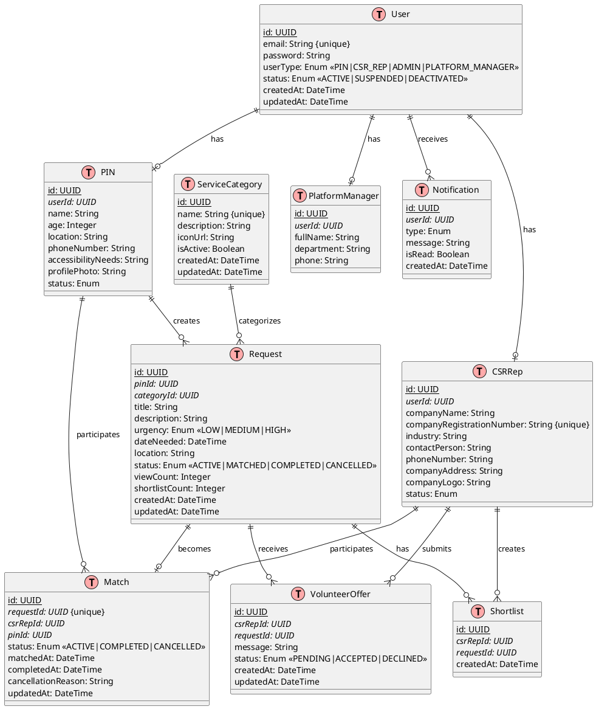

# Class Diagrams - PlantUML Format

This document contains UML class diagrams and Entity Relationship Diagrams (ERD) in PlantUML format for the CSR Volunteer Matching System.

## Table of Contents
1. [Entity Relationship Diagram (ERD)](#1-entity-relationship-diagram-erd)
2. [Entity Class Diagram (Repository Pattern)](#2-entity-class-diagram-repository-pattern)
3. [Controller Class Diagram](#3-controller-class-diagram)

---

## 1. Entity Relationship Diagram (ERD)

**Database Schema:** Shows the relationships between all database tables in the PostgreSQL database.

**Note:** User table has 4 user types (PIN, CSR_REP, ADMIN, PLATFORM_MANAGER), but ADMIN users have no separate profile table. Only PIN, CSRRep, and PlatformManager have profile tables.



---

## 2. Entity Class Diagram (Repository Pattern)

**Entity Classes:** Located in `server/src/entities/`. These classes combine domain business logic (instance methods) with data access operations (static methods) following the Repository Pattern.

```plantuml
@startuml Entity_Classes

class UserEntity {
  +id: String
  +email: String
  +password: String
  +userType: UserType
  +status: UserStatus
  +createdAt: DateTime
  +updatedAt: DateTime
  +pin: PIN
  +csrRep: CSRRep
  +platformManager: PlatformManager
  __Instance Methods (Business Logic)__
  +isActive(): boolean
  +isSuspended(): boolean
  +isAdmin(): boolean
  +isPIN(): boolean
  +isCSRRep(): boolean
  +isPlatformManager(): boolean
  +getProfile(): PIN | CSRRep | PlatformManager
  +toJSON(): Object
  __Static Methods (CRUD - Repository)__
  +{static} findAll(page, limit): Promise<UserEntity[]>
  +{static} findById(id): Promise<UserEntity>
  +{static} findByEmail(email): Promise<UserEntity>
  +{static} findByType(type, page, limit): Promise<UserEntity[]>
  +{static} findByStatus(status, page, limit): Promise<UserEntity[]>
  +{static} create(data): Promise<UserEntity>
  +{static} update(id, data): Promise<UserEntity>
  +{static} delete(id): Promise<boolean>
  +{static} suspend(id): Promise<UserEntity>
  +{static} activate(id): Promise<UserEntity>
}

class RequestEntity {
  +id: String
  +pinId: String
  +categoryId: String
  +title: String
  +description: String
  +urgency: UrgencyLevel
  +dateNeeded: DateTime
  +location: String
  +status: RequestStatus
  +viewCount: number
  +shortlistCount: number
  +createdAt: DateTime
  +updatedAt: DateTime
  __Instance Methods__
  +isActive(): boolean
  +isMatched(): boolean
  +isCompleted(): boolean
  +isUrgent(): boolean
  +isOverdue(): boolean
  +incrementViewCount(): number
  +incrementShortlistCount(): number
  __Static Methods__
  +{static} findAll(page, limit): Promise<RequestEntity[]>
  +{static} findById(id): Promise<RequestEntity>
  +{static} findByPIN(pinId, page, limit): Promise<RequestEntity[]>
  +{static} findByCategory(categoryId, page, limit): Promise<RequestEntity[]>
  +{static} findByStatus(status, page, limit): Promise<RequestEntity[]>
  +{static} findByUrgency(urgency, page, limit): Promise<RequestEntity[]>
  +{static} create(data): Promise<RequestEntity>
  +{static} update(id, data): Promise<RequestEntity>
  +{static} delete(id): Promise<boolean>
  +{static} incrementViewCountDB(id): Promise<RequestEntity>
  +{static} incrementShortlistCountDB(id): Promise<RequestEntity>
}

class PINEntity {
  +id: String
  +userId: String
  +name: String
  +age: number
  +location: String
  +phoneNumber: String
  +accessibilityNeeds: String
  +status: ProfileStatus
  __Instance Methods__
  +isActive(): boolean
  +isPending(): boolean
  +toJSON(): Object
  __Static Methods__
  +{static} findAll(page, limit): Promise<PINEntity[]>
  +{static} findById(id): Promise<PINEntity>
  +{static} findByUserId(userId): Promise<PINEntity>
  +{static} create(data): Promise<PINEntity>
  +{static} update(id, data): Promise<PINEntity>
  +{static} delete(id): Promise<boolean>
}

class CSRRepEntity {
  +id: String
  +userId: String
  +companyName: String
  +companyRegistrationNumber: String
  +industry: String
  +contactPerson: String
  +phoneNumber: String
  +status: ProfileStatus
  __Instance Methods__
  +isActive(): boolean
  +isPending(): boolean
  +toJSON(): Object
  __Static Methods__
  +{static} findAll(page, limit): Promise<CSRRepEntity[]>
  +{static} findById(id): Promise<CSRRepEntity>
  +{static} findByUserId(userId): Promise<CSRRepEntity>
  +{static} create(data): Promise<CSRRepEntity>
  +{static} update(id, data): Promise<CSRRepEntity>
  +{static} delete(id): Promise<boolean>
}

class PlatformManagerEntity {
  +id: String
  +userId: String
  +fullName: String
  +department: String
  +phone: String
  __Instance Methods__
  +toJSON(): Object
  __Static Methods__
  +{static} findAll(page, limit): Promise<PlatformManagerEntity[]>
  +{static} findById(id): Promise<PlatformManagerEntity>
  +{static} findByUserId(userId): Promise<PlatformManagerEntity>
  +{static} create(data): Promise<PlatformManagerEntity>
  +{static} update(id, data): Promise<PlatformManagerEntity>
}

class MatchEntity {
  +id: String
  +requestId: String
  +csrRepId: String
  +pinId: String
  +status: MatchStatus
  +matchedAt: DateTime
  +completedAt: DateTime
  +cancellationReason: String
  __Instance Methods__
  +isActive(): boolean
  +isCompleted(): boolean
  +isCancelled(): boolean
  +toJSON(): Object
  __Static Methods__
  +{static} findAll(page, limit): Promise<MatchEntity[]>
  +{static} findById(id): Promise<MatchEntity>
  +{static} findByPIN(pinId): Promise<MatchEntity[]>
  +{static} findByCSRRep(csrRepId): Promise<MatchEntity[]>
  +{static} findByRequest(requestId): Promise<MatchEntity>
  +{static} create(data): Promise<MatchEntity>
  +{static} complete(id): Promise<MatchEntity>
  +{static} cancel(id, reason): Promise<MatchEntity>
}

class ServiceCategoryEntity {
  +id: String
  +name: String
  +description: String
  +iconUrl: String
  +isActive: boolean
  +createdAt: DateTime
  __Instance Methods__
  +toJSON(): Object
  __Static Methods__
  +{static} findAll(): Promise<ServiceCategoryEntity[]>
  +{static} findActive(): Promise<ServiceCategoryEntity[]>
  +{static} findById(id): Promise<ServiceCategoryEntity>
  +{static} create(data): Promise<ServiceCategoryEntity>
  +{static} update(id, data): Promise<ServiceCategoryEntity>
  +{static} delete(id): Promise<boolean>
}

class ShortlistEntity {
  +id: String
  +csrRepId: String
  +requestId: String
  +createdAt: DateTime
  __Static Methods__
  +{static} findAll(): Promise<ShortlistEntity[]>
  +{static} findByCSRRep(csrRepId): Promise<ShortlistEntity[]>
  +{static} findByRequest(requestId): Promise<ShortlistEntity[]>
  +{static} exists(csrRepId, requestId): Promise<boolean>
  +{static} create(data): Promise<ShortlistEntity>
  +{static} deleteByCSRRepAndRequest(csrRepId, requestId): Promise<boolean>
}

class VolunteerOfferEntity {
  +id: String
  +csrRepId: String
  +requestId: String
  +message: String
  +status: OfferStatus
  +createdAt: DateTime
  __Instance Methods__
  +isPending(): boolean
  +isAccepted(): boolean
  +isDeclined(): boolean
  __Static Methods__
  +{static} findAll(): Promise<VolunteerOfferEntity[]>
  +{static} findByCSRRep(csrRepId): Promise<VolunteerOfferEntity[]>
  +{static} findByRequest(requestId): Promise<VolunteerOfferEntity[]>
  +{static} create(data): Promise<VolunteerOfferEntity>
  +{static} accept(id): Promise<VolunteerOfferEntity>
  +{static} decline(id): Promise<VolunteerOfferEntity>
}

class NotificationEntity {
  +id: String
  +userId: String
  +type: NotificationType
  +message: String
  +isRead: boolean
  +createdAt: DateTime
  __Static Methods__
  +{static} findByUser(userId): Promise<NotificationEntity[]>
  +{static} findUnreadByUser(userId): Promise<NotificationEntity[]>
  +{static} create(data): Promise<NotificationEntity>
  +{static} markAsRead(id): Promise<NotificationEntity>
  +{static} deleteByUser(userId): Promise<boolean>
}

UserEntity "1" -- "0..1" PINEntity
UserEntity "1" -- "0..1" CSRRepEntity
UserEntity "1" -- "0..1" PlatformManagerEntity
UserEntity "1" -- "*" NotificationEntity

PINEntity "1" -- "*" RequestEntity
PINEntity "1" -- "*" MatchEntity

CSRRepEntity "1" -- "*" ShortlistEntity
CSRRepEntity "1" -- "*" VolunteerOfferEntity
CSRRepEntity "1" -- "*" MatchEntity

ServiceCategoryEntity "1" -- "*" RequestEntity

RequestEntity "1" -- "*" ShortlistEntity
RequestEntity "1" -- "*" VolunteerOfferEntity
RequestEntity "1" -- "0..1" MatchEntity

note right of UserEntity
  Entity classes implement
  Repository Pattern:
  - Instance methods: Business logic
  - Static methods: Data access (CRUD)
  - Uses Prisma ORM internally
end note

note right of RequestEntity
  All entities follow same pattern:
  - Encapsulate domain logic
  - Provide CRUD operations
  - Return entity instances
  - Type-safe operations
end note

@enduml
```



---

## 3. Controller Class Diagram

**Controllers:** Located in `server/src/controllers/`. Organized by feature/user type (58 controller files). Controllers orchestrate business logic by calling Entity classes.

```plantuml
@startuml Controllers

package "Auth Controllers" {
  class LoginController {
    +{static} handle(req, res, next): Promise<void>
  }
  
  class RegisterPINController {
    +{static} handle(req, res, next): Promise<void>
  }
  
  class RegisterCSRRepController {
    +{static} handle(req, res, next): Promise<void>
  }
  
  class GetProfileController {
    +{static} handle(req, res, next): Promise<void>
  }
  
  class UpdatePasswordController {
    +{static} handle(req, res, next): Promise<void>
  }
  
  class LogoutController {
    +{static} handle(req, res, next): Promise<void>
  }
}

package "User Admin Controllers" {
  class CreateUserController {
    +{static} handle(req, res, next): Promise<void>
  }
  
  class GetUsersController {
    +{static} handle(req, res, next): Promise<void>
  }
  
  class GetUserDetailsController {
    +{static} handle(req, res, next): Promise<void>
  }
  
  class UpdateUserStatusController {
    +{static} handle(req, res, next): Promise<void>
  }
  
  class DeleteUserController {
    +{static} handle(req, res, next): Promise<void>
  }
}

package "PIN Controllers" {
  class CreateRequestController {
    +{static} handle(req, res, next): Promise<void>
  }
  
  class ViewRequestsController {
    +{static} handle(req, res, next): Promise<void>
  }
  
  class UpdateRequestController {
    +{static} handle(req, res, next): Promise<void>
  }
  
  class DeleteRequestController {
    +{static} handle(req, res, next): Promise<void>
  }
  
  class SearchMyRequestsController {
    +{static} handle(req, res, next): Promise<void>
  }
  
  class ViewRequestOffersController {
    +{static} handle(req, res, next): Promise<void>
  }
  
  class AcceptOfferController {
    +{static} handle(req, res, next): Promise<void>
  }
  
  class DeclineOfferController {
    +{static} handle(req, res, next): Promise<void>
  }
}

package "CSR Rep Controllers" {
  class SearchRequestsController {
    +{static} handle(req, res, next): Promise<void>
  }
  
  class SaveRequestController {
    +{static} handle(req, res, next): Promise<void>
  }
  
  class RemoveShortlistController {
    +{static} handle(req, res, next): Promise<void>
  }
  
  class SubmitOfferController {
    +{static} handle(req, res, next): Promise<void>
  }
  
  class ViewMyOffersController {
    +{static} handle(req, res, next): Promise<void>
  }
  
  class ViewMyMatchesController {
    +{static} handle(req, res, next): Promise<void>
  }
}

package "Platform Manager Controllers" {
  class CreateCategoryController {
    +{static} handle(req, res, next): Promise<void>
  }
  
  class GetCategoriesController {
    +{static} handle(req, res, next): Promise<void>
  }
  
  class UpdateCategoryController {
    +{static} handle(req, res, next): Promise<void>
  }
  
  class DeleteCategoryController {
    +{static} handle(req, res, next): Promise<void>
  }
  
  class GetPlatformStatsController {
    +{static} handle(req, res, next): Promise<void>
  }
}

class MatchController {
  +{static} createMatch(req, res, next): Promise<void>
  +{static} getMatches(req, res, next): Promise<void>
  +{static} completeMatch(req, res, next): Promise<void>
  +{static} cancelMatch(req, res, next): Promise<void>
}

' Dependencies on Entities
LoginController ..> UserEntity
RegisterPINController ..> UserEntity
RegisterPINController ..> PINEntity
RegisterCSRRepController ..> UserEntity
RegisterCSRRepController ..> CSRRepEntity

CreateUserController ..> UserEntity
GetUsersController ..> UserEntity
UpdateUserStatusController ..> UserEntity
DeleteUserController ..> UserEntity

CreateRequestController ..> PINEntity
CreateRequestController ..> RequestEntity
ViewRequestsController ..> RequestEntity
UpdateRequestController ..> RequestEntity
DeleteRequestController ..> RequestEntity
SearchMyRequestsController ..> RequestEntity

SearchRequestsController ..> RequestEntity
SaveRequestController ..> CSRRepEntity
SaveRequestController ..> RequestEntity
SaveRequestController ..> ShortlistEntity
SubmitOfferController ..> CSRRepEntity
SubmitOfferController ..> RequestEntity
SubmitOfferController ..> VolunteerOfferEntity

AcceptOfferController ..> VolunteerOfferEntity
DeclineOfferController ..> VolunteerOfferEntity

CreateCategoryController ..> ServiceCategoryEntity
GetCategoriesController ..> ServiceCategoryEntity
UpdateCategoryController ..> ServiceCategoryEntity
GetPlatformStatsController ..> ServiceCategoryEntity
GetPlatformStatsController ..> RequestEntity
GetPlatformStatsController ..> MatchEntity

MatchController ..> MatchEntity
MatchController ..> RequestEntity
MatchController ..> NotificationEntity

note "Controllers orchestrate business\nlogic by calling Entity class\nmethods (Repository Pattern)" as N1

@enduml
```



---

## How to Use These Diagrams

### View Online
1. **PlantText:** https://www.planttext.com/
   - Copy the PlantUML code (between ```plantuml``` markers)
   - Paste and view
   
2. **PlantUML Web Server:** http://www.plantuml.com/plantuml/uml/
   - Copy the code
   - View rendered diagram

### Generate Images

```bash
# Install PlantUML (macOS)
brew install plantuml

# Install PlantUML (Linux)
sudo apt-get install plantuml

# Generate PNG images
plantuml CLASS_DIAGRAMS.md

# Generate SVG (better quality for reports)
plantuml -tsvg CLASS_DIAGRAMS.md
```

### VS Code
Install PlantUML extension:
```bash
code --install-extension jebbs.plantuml
```

---

## Legend

### Symbols
- **PK** = Primary Key
- **FK** = Foreign Key  
- **UK** = Unique Key
- `+` = Public
- `-` = Private
- `#` = Protected
- `{static}` = Static method

### Method Naming Convention
- **Instance methods**: Business logic (e.g., `isActive()`, `isPIN()`)
- **Static methods**: Data access (e.g., `findById()`, `create()`)

---

## Notes

- All diagrams reflect the **actual implementation** as of October 2025
- Entity classes use **Repository Pattern** (domain logic + data access)
- Controllers call Entity classes (not Prisma directly)
- No service layer exists in this architecture
- For Mermaid diagrams (auto-render on GitHub), see [CLASS_DIAGRAMS_MERMAID.md](./CLASS_DIAGRAMS_MERMAID.md)

---

**Last Updated:** October 22, 2025
