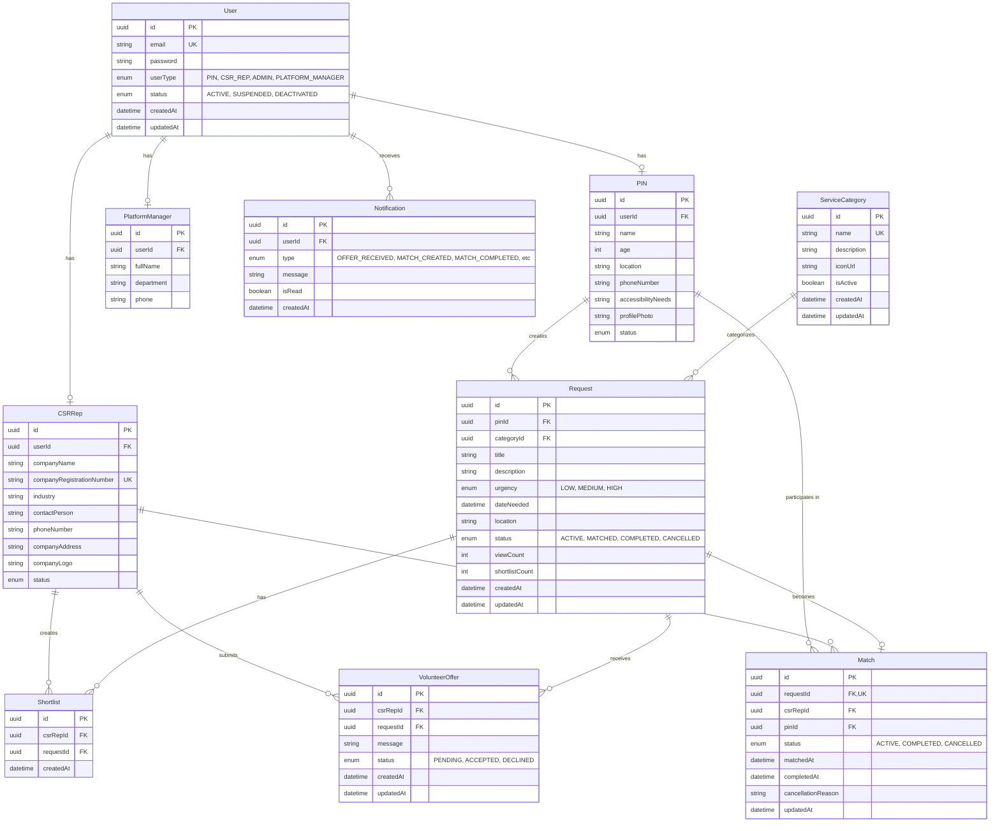
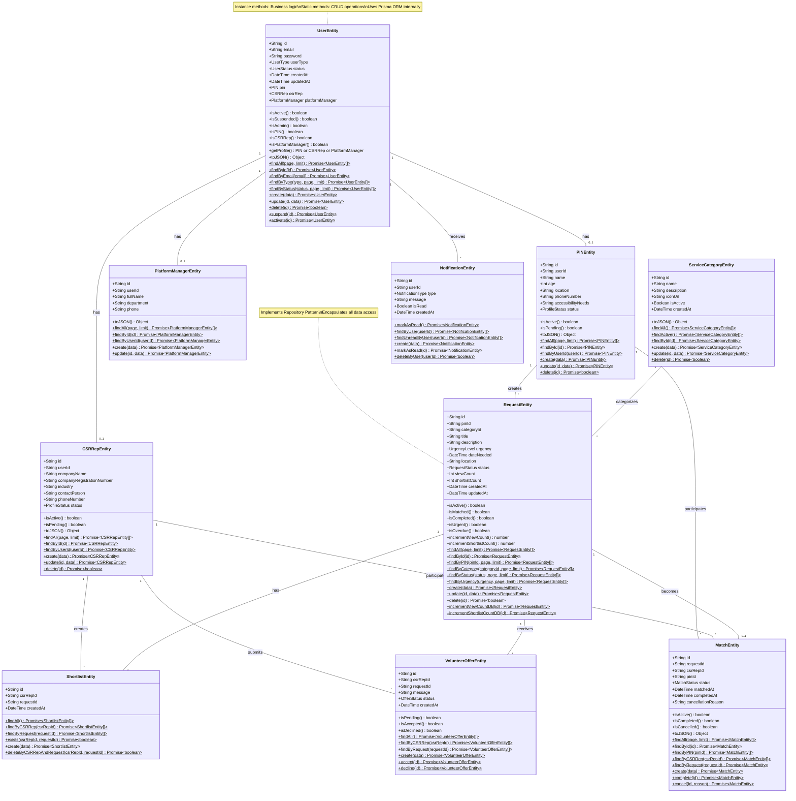
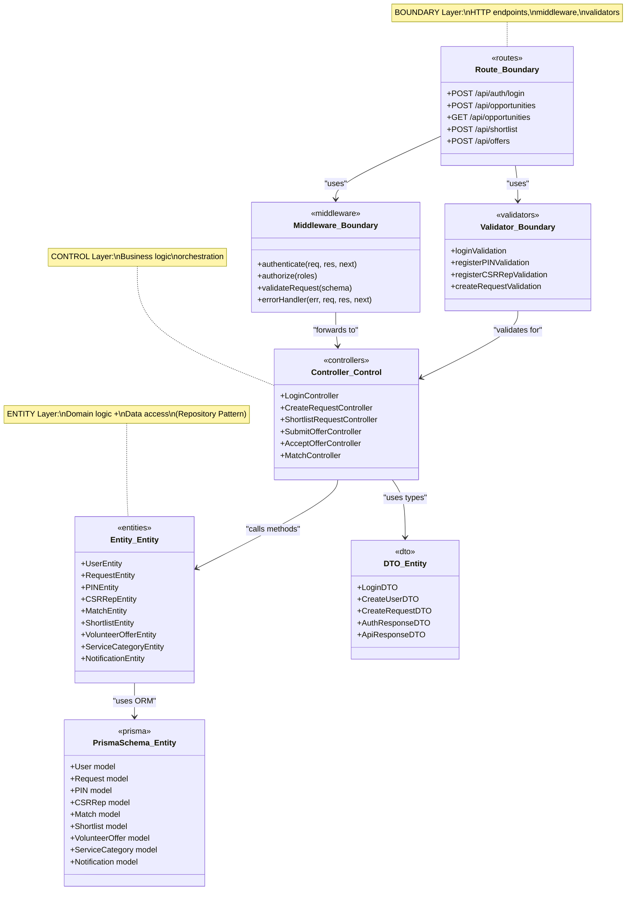

# Class Diagrams - Mermaid Format

This document contains class diagrams and ERD in Mermaid format that render automatically on GitHub.

## Table of Contents
1. [Entity Relationship Diagram (ERD)](#1-entity-relationship-diagram-erd)
2. [Entity Class Diagram (Repository Pattern)](#2-entity-class-diagram-repository-pattern)
3. [Controller Class Diagram](#3-controller-class-diagram)
4. [BCE Architecture Diagram](#4-bce-architecture-diagram)

---

## 1. Entity Relationship Diagram (ERD)

**Database Schema:** Shows the relationships between all database tables in the PostgreSQL database.

**Note:** User table has 4 user types (PIN, CSR_REP, ADMIN, PLATFORM_MANAGER), but ADMIN users have no separate profile table. Only PIN, CSRRep, and PlatformManager have profile tables.

---

## 2. Entity Class Diagram (Repository Pattern)

**Entity Classes:** Located in `server/src/entities/`. These classes combine domain business logic (instance methods) with data access operations (static methods) following the Repository Pattern.

---

## 3. Controller Class Diagram

**Controllers:** Located in `server/src/controllers/`. Organized by feature/user type. Controllers orchestrate business logic by calling Entity classes.

```mermaid
classDiagram
    class LoginController {
        <<static>>
        +handle(req, res, next) Promise~void~
    }

    class RegisterPINController {
        <<static>>
        +handle(req, res, next) Promise~void~
    }

    class RegisterCSRRepController {
        <<static>>
        +handle(req, res, next) Promise~void~
    }

    class GetProfileController {
        <<static>>
        +handle(req, res, next) Promise~void~
    }

    class UpdatePasswordController {
        <<static>>
        +handle(req, res, next) Promise~void~
    }

    class CreateUserController {
        <<static>>
        +handle(req, res, next) Promise~void~
    }

    class GetUsersController {
        <<static>>
        +handle(req, res, next) Promise~void~
    }

    class UpdateUserStatusController {
        <<static>>
        +handle(req, res, next) Promise~void~
    }

    class DeleteUserController {
        <<static>>
        +handle(req, res, next) Promise~void~
    }

    class CreateRequestController {
        <<static>>
        +handle(req, res, next) Promise~void~
    }

    class ViewRequestsController {
        <<static>>
        +handle(req, res, next) Promise~void~
    }

    class UpdateRequestController {
        <<static>>
        +handle(req, res, next) Promise~void~
    }

    class DeleteRequestController {
        <<static>>
        +handle(req, res, next) Promise~void~
    }

    class SearchRequestsController {
        <<static>>
        +handle(req, res, next) Promise~void~
    }

    class ShortlistRequestController {
        <<static>>
        +handle(req, res, next) Promise~void~
    }

    class RemoveShortlistController {
        <<static>>
        +handle(req, res, next) Promise~void~
    }

    class SubmitOfferController {
        <<static>>
        +handle(req, res, next) Promise~void~
    }

    class ViewOffersController {
        <<static>>
        +handle(req, res, next) Promise~void~
    }

    class AcceptOfferController {
        <<static>>
        +handle(req, res, next) Promise~void~
    }

    class DeclineOfferController {
        <<static>>
        +handle(req, res, next) Promise~void~
    }

    class MatchController {
        <<static>>
        +createMatch(req, res, next) Promise~void~
        +getMatches(req, res, next) Promise~void~
        +completeMatch(req, res, next) Promise~void~
        +cancelMatch(req, res, next) Promise~void~
    }

    class CreateCategoryController {
        <<static>>
        +handle(req, res, next) Promise~void~
    }

    class GetCategoriesController {
        <<static>>
        +handle(req, res, next) Promise~void~
    }

    class GetPlatformStatsController {
        <<static>>
        +handle(req, res, next) Promise~void~
    }

    LoginController ..> UserEntity : uses
    RegisterPINController ..> UserEntity : uses
    RegisterPINController ..> PINEntity : uses
    RegisterCSRRepController ..> UserEntity : uses
    RegisterCSRRepController ..> CSRRepEntity : uses
    GetProfileController ..> UserEntity : uses
    
    CreateUserController ..> UserEntity : uses
    GetUsersController ..> UserEntity : uses
    UpdateUserStatusController ..> UserEntity : uses
    DeleteUserController ..> UserEntity : uses
    
    CreateRequestController ..> PINEntity : uses
    CreateRequestController ..> RequestEntity : uses
    ViewRequestsController ..> RequestEntity : uses
    UpdateRequestController ..> RequestEntity : uses
    DeleteRequestController ..> RequestEntity : uses
    SearchRequestsController ..> RequestEntity : uses
    
    ShortlistRequestController ..> CSRRepEntity : uses
    ShortlistRequestController ..> RequestEntity : uses
    ShortlistRequestController ..> ShortlistEntity : uses
    RemoveShortlistController ..> ShortlistEntity : uses
    
    SubmitOfferController ..> CSRRepEntity : uses
    SubmitOfferController ..> RequestEntity : uses
    SubmitOfferController ..> VolunteerOfferEntity : uses
    ViewOffersController ..> VolunteerOfferEntity : uses
    AcceptOfferController ..> VolunteerOfferEntity : uses
    DeclineOfferController ..> VolunteerOfferEntity : uses
    
    MatchController ..> MatchEntity : uses
    MatchController ..> RequestEntity : uses
    MatchController ..> NotificationEntity : uses
    
    CreateCategoryController ..> ServiceCategoryEntity : uses
    GetCategoriesController ..> ServiceCategoryEntity : uses
    GetPlatformStatsController ..> ServiceCategoryEntity : uses
    GetPlatformStatsController ..> RequestEntity : uses
    GetPlatformStatsController ..> MatchEntity : uses

    note for LoginController "Controllers use Entity classes\nfor all data operations"
    note for CreateRequestController "Entity classes implement\nRepository Pattern"
```

---

## 4. BCE Architecture Diagram

**BCE Pattern:** Shows how Boundary, Control, and Entity layers interact.

---

## How to View These Diagrams

### GitHub
Mermaid diagrams render automatically on GitHub. Just view this file in your repository.

### VS Code
1. Install "Markdown Preview Mermaid Support" extension
2. Open this file and click the preview button (Ctrl+Shift+V or Cmd+Shift+V)

### Online Viewers
- [Mermaid Live Editor](https://mermaid.live/)
- Copy and paste any diagram code to visualize

---

## Legend

### Symbols
- **PK** = Primary Key
- **FK** = Foreign Key  
- **UK** = Unique Key
- **$** = Static method
- **+** = Public method/property
- **-** = Private method/property

### Method Naming Convention
- **Instance methods** (lowercase start): Business logic - `isActive()`, `isPIN()`
- **Static methods** (with $): Data access - `findById()$`, `create()$`

---

## Notes

- All diagrams reflect the **actual implementation** as of October 2025
- Entity classes use **Repository Pattern** (domain logic + data access)
- Controllers call Entity classes (not Prisma directly)
- No service layer exists in this architecture
- For PlantUML diagrams, see [CLASS_DIAGRAMS_PLANTUML.md](./CLASS_DIAGRAMS_PLANTUML.md)

---

**Last Updated:** October 22, 2025
