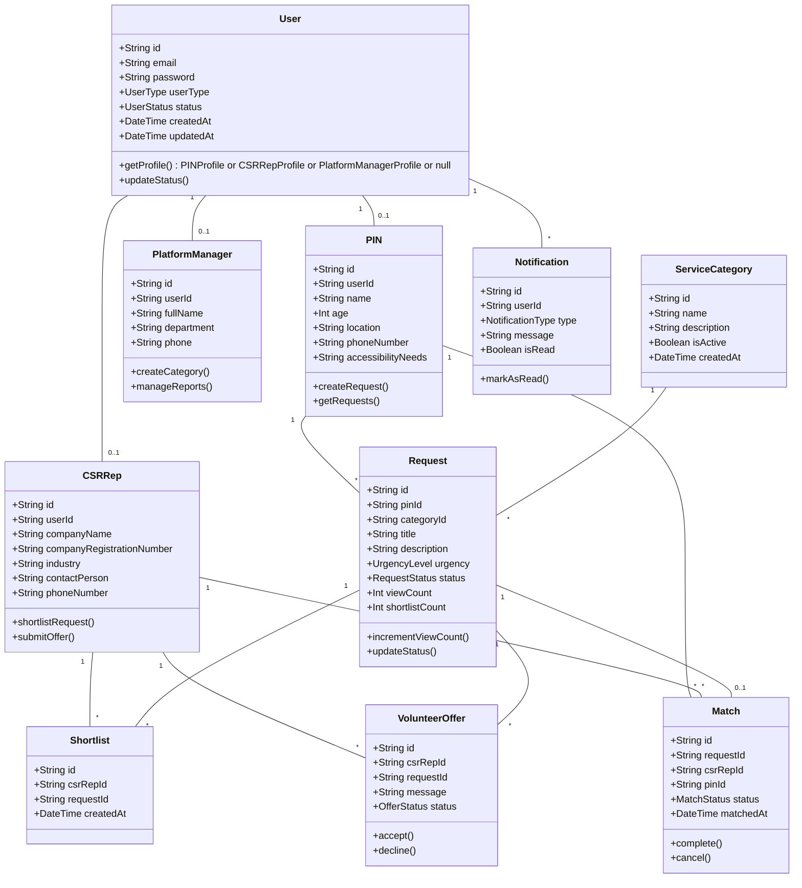
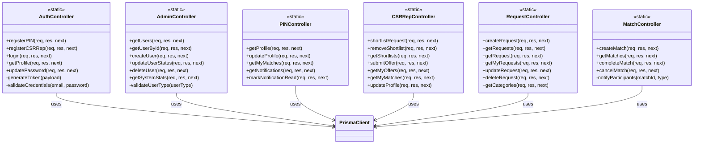

# Class Diagrams - Mermaid Format

This document contains class diagrams and ERD in Mermaid format that render automatically on GitHub.

## Table of Contents
1. [Entity Relationship Diagram (ERD)](#1-entity-relationship-diagram-erd)
2. [Entity Class Diagram](#2-entity-class-diagram)
3. [Controller Class Diagram](#3-controller-class-diagram)
4. [Service Layer Diagram](#4-service-layer-diagram)

---

## 1. Entity Relationship Diagram (ERD)

**Note:** User table has 4 user types (PIN, CSR_REP, ADMIN, PLATFORM_MANAGER), but ADMIN users have no separate profile table. Only PIN, CSRRep, and PlatformManager have profile tables.

```mermaid
erDiagram
    User ||--o| PIN : "has"
    User ||--o| CSRRep : "has"
    User ||--o| PlatformManager : "has"
    User ||--o{ Notification : "receives"
    
    PIN ||--o{ Request : "creates"
    PIN ||--o{ Match : "participates in"
    
    CSRRep ||--o{ Shortlist : "creates"
    CSRRep ||--o{ VolunteerOffer : "submits"
    CSRRep ||--o{ Match : "participates in"
    
    ServiceCategory ||--o{ Request : "categorizes"
    
    Request ||--o{ Shortlist : "has"
    Request ||--o{ VolunteerOffer : "receives"
    Request ||--o| Match : "becomes"
    
    User {
        uuid id PK
        string email UK
        string password
        enum userType "PIN, CSR_REP, ADMIN, PLATFORM_MANAGER"
        enum status
        datetime createdAt
        datetime updatedAt
        string note "ADMIN users have no profile table"
    }
    
    PIN {
        uuid id PK
        uuid userId FK
        string name
        int age
        string location
        string phoneNumber
        string accessibilityNeeds
        string profilePhoto
    }
    
    CSRRep {
        uuid id PK
        uuid userId FK
        string companyName
        string companyRegistrationNumber UK
        string industry
        string contactPerson
        string phoneNumber
        string companyAddress
        string companyLogo
    }
    
    PlatformManager {
        uuid id PK
        uuid userId FK
        string fullName
        string department
        string phone
    }
    
    ServiceCategory {
        uuid id PK
        string name UK
        string description
        string iconUrl
        boolean isActive
        datetime createdAt
        datetime updatedAt
    }
    
    Request {
        uuid id PK
        uuid pinId FK
        uuid categoryId FK
        string title
        string description
        enum urgency
        datetime dateNeeded
        string location
        enum status
        int viewCount
        int shortlistCount
        datetime createdAt
        datetime updatedAt
    }
    
    Shortlist {
        uuid id PK
        uuid csrRepId FK
        uuid requestId FK
        datetime createdAt
    }
    
    VolunteerOffer {
        uuid id PK
        uuid csrRepId FK
        uuid requestId FK
        string message
        enum status
        datetime createdAt
        datetime updatedAt
    }
    
    Match {
        uuid id PK
        uuid requestId FK,UK
        uuid csrRepId FK
        uuid pinId FK
        enum status
        datetime matchedAt
        datetime completedAt
        string cancellationReason
        datetime updatedAt
    }
    
    Notification {
        uuid id PK
        uuid userId FK
        enum type
        string message
        boolean isRead
        datetime createdAt
    }
```

---

## 2. Entity Class Diagram

**Note:** UserType includes PIN, CSR_REP, ADMIN, and PLATFORM_MANAGER, but ADMIN users have no profile table.

---

## 3. Controller Class Diagram

---

## 4. Service Layer Diagram

---

## How to View These Diagrams

### GitHub
Mermaid diagrams render automatically on GitHub. Just view this file in your repository.

### VS Code
1. Install "Markdown Preview Mermaid Support" extension
2. Open this file and click the preview button

### Online Viewers
- [Mermaid Live Editor](https://mermaid.live/)
- Copy and paste any diagram code to visualize

---

## Notes
- **PK** = Primary Key
- **FK** = Foreign Key
- **UK** = Unique Key
- Diagrams render automatically on GitHub
- For PlantUML diagrams, see [CLASS_DIAGRAMS.md](./CLASS_DIAGRAMS.md)

