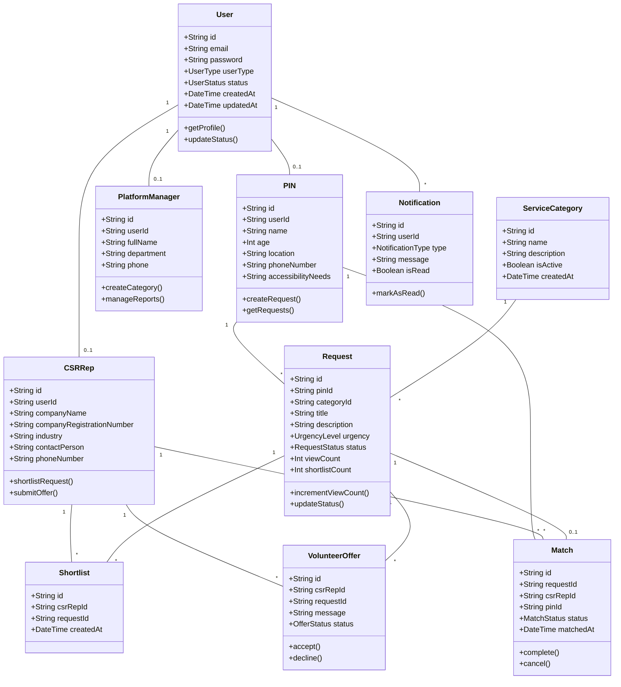
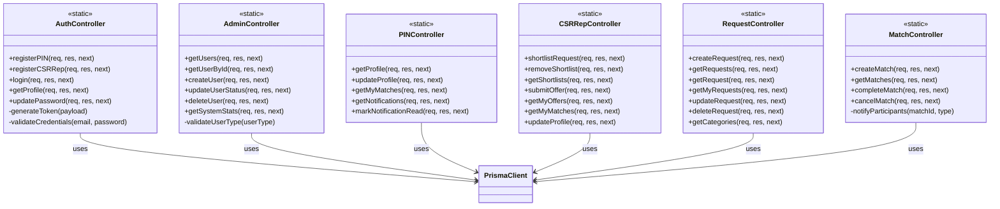
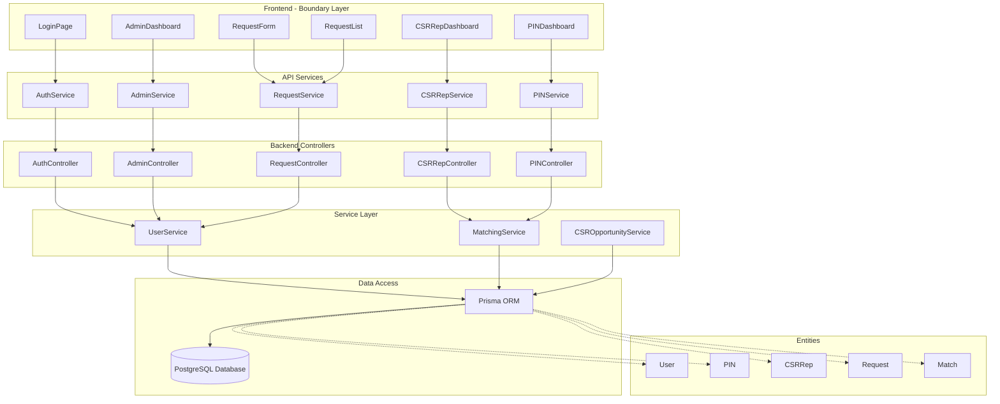
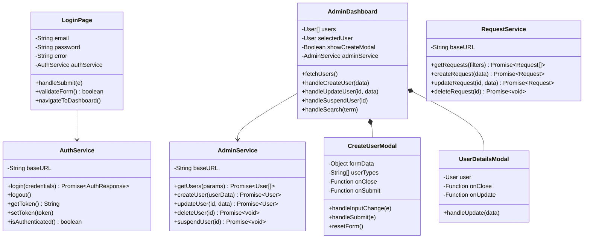
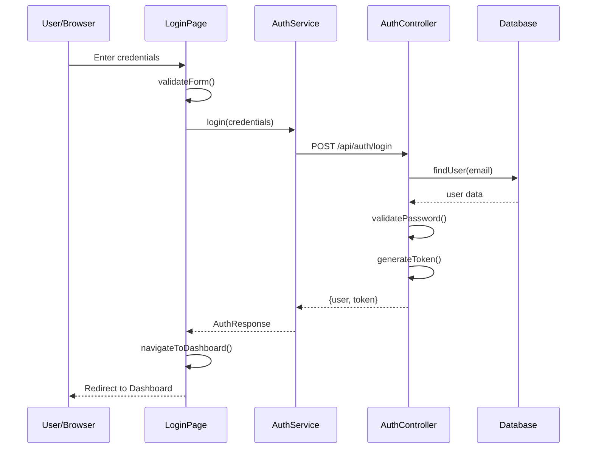
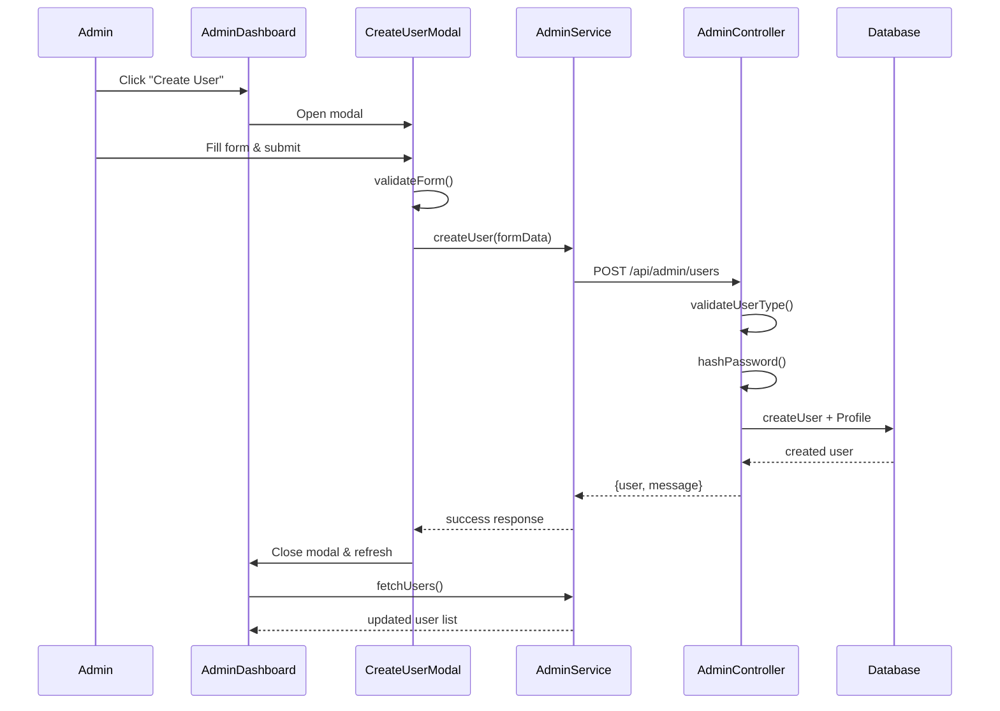
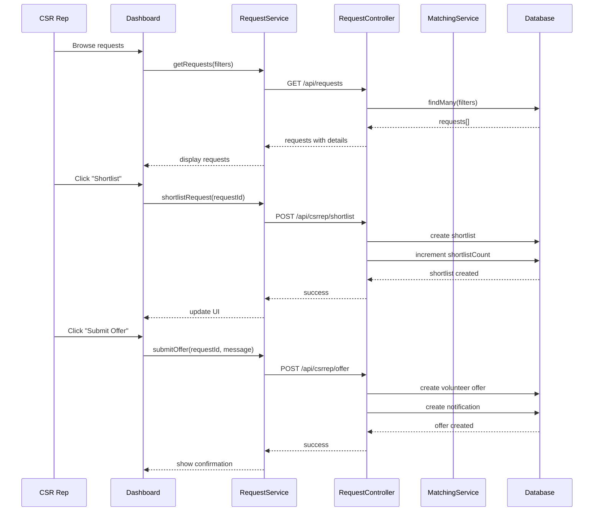

# Class Diagrams - Mermaid Format

This document contains class diagrams in Mermaid format that can be rendered directly on GitHub and most markdown viewers.

## Table of Contents
1. [Entity Relationship Diagram](#1-entity-relationship-diagram)
2. [Controller Class Diagram](#2-controller-class-diagram)
3. [Service Layer Diagram](#3-service-layer-diagram)
4. [System Architecture Overview](#4-system-architecture-overview)

---

## 1. Entity Relationship Diagram



---

## 2. Controller Class Diagram



---

## 3. Service Layer Diagram

```mermaid
classDiagram
    class UserService {
        -UserRepository userRepository
        +createUser(userData) ApiResponse~User~
        +getUserById(id) ApiResponse~User~
        +updateUser(id, updates) ApiResponse~User~
        +deleteUser(id) ApiResponse~boolean~
        +getAllUsers(limit, offset) ApiResponse~User[]~
    }

    class VolunteerService {
        -VolunteerRepository volunteerRepository
        +createVolunteer(data) ApiResponse~Volunteer~
        +getVolunteerById(id) ApiResponse~Volunteer~
        +updateVolunteer(id, updates) ApiResponse~Volunteer~
        +findVolunteersBySkills(skills) ApiResponse~Volunteer[]~
    }

    class CSROpportunityService {
        -CSROpportunityRepository opportunityRepository
        -OrganizationRepository organizationRepository
        +createOpportunity(data) ApiResponse~CSROpportunity~
        +getOpportunityById(id) ApiResponse~CSROpportunity~
        +updateOpportunity(id, updates) ApiResponse~CSROpportunity~
        +getActiveOpportunities() ApiResponse~CSROpportunity[]~
    }

    class MatchingService {
        -MatchingRepository matchingRepository
        -VolunteerRepository volunteerRepository
        -CSROpportunityRepository opportunityRepository
        +findMatchesForVolunteer(volunteerId) ApiResponse~Matching[]~
        -calculateMatchScore(volunteer, opportunity) number
        -generateMatchReasons(volunteer, opportunity) string[]
    }

    class UserRepository {
        <<interface>>
        +findById(id) Promise~User~
        +findByEmail(email) Promise~User~
        +create(user) Promise~User~
        +update(id, updates) Promise~User~
        +delete(id) Promise~boolean~
    }

    class VolunteerRepository {
        <<interface>>
        +findById(id) Promise~Volunteer~
        +create(volunteer) Promise~Volunteer~
        +update(id, updates) Promise~Volunteer~
        +findBySkills(skills) Promise~Volunteer[]~
    }

    class CSROpportunityRepository {
        <<interface>>
        +findById(id) Promise~CSROpportunity~
        +create(opportunity) Promise~CSROpportunity~
        +update(id, updates) Promise~CSROpportunity~
        +findActive() Promise~CSROpportunity[]~
    }

    class MatchingRepository {
        <<interface>>
        +findById(id) Promise~Matching~
        +create(matching) Promise~Matching~
        +findByVolunteer(volunteerId) Promise~Matching[]~
    }

    UserService --> UserRepository : uses
    VolunteerService --> VolunteerRepository : uses
    CSROpportunityService --> CSROpportunityRepository : uses
    CSROpportunityService --> OrganizationRepository : uses
    MatchingService --> MatchingRepository : uses
    MatchingService --> VolunteerRepository : uses
    MatchingService --> CSROpportunityRepository : uses
```



---

## 4. System Architecture Overview



---

## 5. Frontend Component Architecture



---

## 6. Request Flow Sequence



---

## 7. User Creation Flow



---

## 8. Request Matching Flow



---

## Enums and Types

### UserType Enum
```
PIN | CSR_REP | ADMIN | PLATFORM_MANAGER
```

### UserStatus Enum
```
ACTIVE | SUSPENDED | DEACTIVATED
```

### RequestStatus Enum
```
ACTIVE | MATCHED | COMPLETED | CANCELLED
```

### UrgencyLevel Enum
```
LOW | MEDIUM | HIGH
```

### OfferStatus Enum
```
PENDING | ACCEPTED | DECLINED
```

### MatchStatus Enum
```
ACTIVE | COMPLETED | CANCELLED
```

### NotificationType Enum
```
VOLUNTEER_OFFER | OFFER_ACCEPTED | OFFER_DECLINED | 
MATCH_CONFIRMED | MATCH_CANCELLED | REQUEST_UPDATED
```

---

## How to View These Diagrams

### GitHub
Mermaid diagrams render automatically on GitHub. Just view this file in your repository.

### VS Code
1. Install "Markdown Preview Mermaid Support" extension
2. Open this file and click the preview button

### Online Viewers
- [Mermaid Live Editor](https://mermaid.live/)
- Copy and paste any diagram code to visualize

---

## Key Architecture Patterns

1. **BCE Pattern**: Boundary (UI) → Controller (API) → Entity (Database)
2. **Repository Pattern**: Data access abstraction
3. **Service Layer**: Business logic encapsulation
4. **MVC Pattern**: Model-View-Controller separation
5. **Dependency Injection**: Loose coupling between components

---

## Related Documentation

- [PlantUML Class Diagrams](./CLASS_DIAGRAMS.md) - Detailed UML diagrams
- [BCE Architecture Guide](./BCE_ARCHITECTURE.md) - Architecture explanation
- [API Documentation](./API_DOCUMENTATION.md) - API endpoints reference

